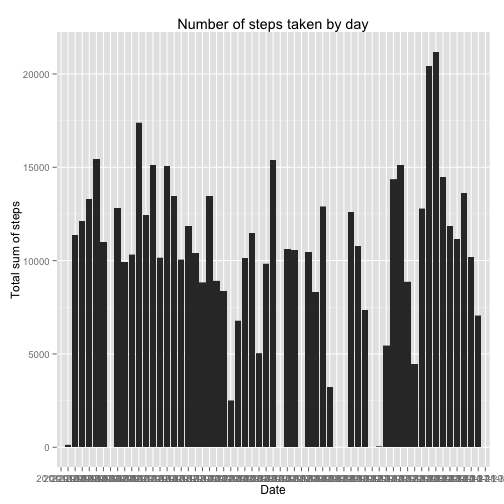
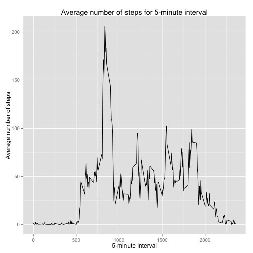
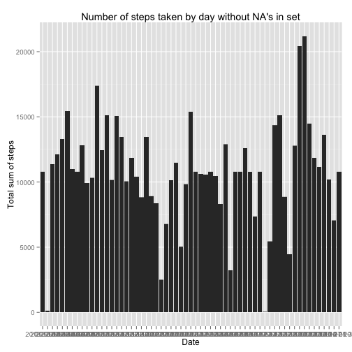
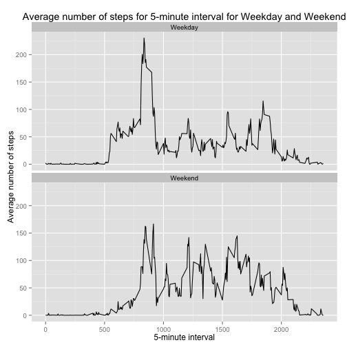

## Loading and preprocessing the data:

```r
# Loading needed libraries:
library(dplyr) 
library(ggplot2) 

## Loading the data:
activity_data <- read.csv('./activity.csv')

## Preprocessing the data:
```

## Calculating what is mean total number of steps taken per day:

```r
## Making a plot of total number of steps taken per day:
ggplot(activity_data, aes(x = date, y = steps)) +
        geom_histogram(stat = "identity") +
        labs(x = "Date", y = "Total sum of steps") +
        labs(title = "Number of steps taken by day")
```

```
## Warning in loop_apply(n, do.ply): Removed 2304 rows containing missing
## values (position_stack).
```

 

```r
### Calculating the total number of steps taken by day:
sum_of_steps_per_day = aggregate(steps ~ date, data = activity_data, sum)

### Calculating mean and median of the total number of steps taken per day:
mean_steps = mean(sum_of_steps_per_day$steps)
median_steps = median(sum_of_steps_per_day$steps)
```

* The mean value of of the total number of steps taken per day is: 
10766.19
* The median value of of the total number of steps taken per day is: 10765

## What is the average daily activity pattern?
### Drowing a time series plot:

```r
###Making a time series plot of the 5-th minute intervals
sum_of_steps_per_interval = aggregate(steps ~ interval,
                                      data = activity_data, mean)
###Making a plot for 5-minute intervals:
ggplot(sum_of_steps_per_interval, aes(x = interval, y = steps)) +
        geom_line() + labs(title = "Average number of steps for 5-minute interval") +
        labs(x = "5-minute interval", y = "Average number of steps")
```

 

```r
###Calculating 5-minute interval with the highest value of average steps:
high_int = sum_of_steps_per_interval[which.max(sum_of_steps_per_interval$steps),1]
high_steps = sum_of_steps_per_interval[which.max(sum_of_steps_per_interval$steps),2]
```
### Which 5-minute interval, on average across all the days in the dataset, contains the maximum number of steps?
*On average across all the days in the dataset 835's 5-munite interval contains the maximum 
number of steps (206.17 steps).

## Imputing missing values
1. Calculate and report the total number of missing values in the dataset (i.e. the total number of rows with NAs):  

```r
activity_data_without_NA = na.omit(activity_data)
missingNumber = length(activity_data[,1]) - length(activity_data_without_NA[,1])
```
Number of missig valuse is: 2304  
2. Devise a strategy for filling in all of the missing values in the dataset. The strategy does not need to be sophisticated. For example, you could use the mean/median for that day, or the mean for that 5-minute interval, etc.  
*As a strategy we will replace NA's values with the value of average steps for this 5-minute interval across all days*
3. Create a new dataset that is equal to the original dataset but with the missing data filled in.  

```r
new_activity_data = activity_data
for (i in 1:nrow(activity_data)) {
        if (is.na(activity_data[i,1])) {
                new_activity_data[i,1] = 
                        sum_of_steps_per_interval[which(sum_of_steps_per_interval$interval == activity_data[i,3]),2]
        }
}
```
4. Make a histogram of the total number of steps taken each day and Calculate and report the mean and median total number of steps taken per day. Do these values differ from the estimates from the first part of the assignment? What is the impact of imputing missing data on the estimates of the total daily number of steps?

```r
### Making a plot of total number of steps taken per day for new set:
ggplot(new_activity_data, aes(x = date, y = steps)) +
        geom_histogram(stat = "identity") +
        labs(x = "Date", y = "Total sum of steps") +
        labs(title = "Number of steps taken by day without NA's in set")
```

 

```r
### Calculating the total number of steps taken by day for new set:
new_sum_of_steps_per_day = aggregate(steps ~ date, data = new_activity_data, sum)
### Calculating mean and median of the total number of steps taken per day for new set:
new_mean_steps = mean(new_sum_of_steps_per_day$steps)
new_median_steps = median(new_sum_of_steps_per_day$steps)
```
* The mean value of of the total number of steps taken per day is: 
10766.19
* The median value of of the total number of steps taken per day is: 
10766.19
* New median value do have some difference with the one we get in the first part, probably due to the chosen strategy of replacing NA values with mean values.  

## Are there differences in activity patterns between weekdays and weekends?
1. Create a new factor variable in the dataset with two levels – “weekday” and “weekend” indicating whether a given date is a weekday or weekend day.  

```r
new_activity_data$date = as.Date(as.character(new_activity_data$date))
new_activity_data['daymeaning'] = factor(sapply(new_activity_data$date, function(x){ if (weekdays(x) == "Sunday" | weekdays(x) == "Saturday") { "Weekend" } else { "Weekday"} }))
```
2. Make a panel plot containing a time series plot (i.e. type = "l") of the 5-minute interval (x-axis) and the average number of steps taken, averaged across all weekday days or weekend days (y-axis). 


```r
new_activity_data_avrg = aggregate(steps ~ interval + daymeaning, data = new_activity_data, mean)
ggplot(new_activity_data_avrg, aes(x = interval, y = steps)) + geom_line() + facet_wrap(~daymeaning, nrow = 2) + labs(x = "5-minute interval", y = "Average number of steps",title="Average number of steps for 5-minute interval for Weekday and Weekend")
```

 
